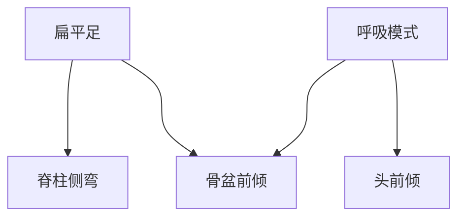

训练实践：[[身体康复训练]]
# 问题
## 呼吸模式
**目前问题**：过度依赖腹式呼吸
	- 胸部没有充分扩张导致圆肩驼背
	- 没有控制、只向前扩张的腹式呼吸导致核心松垮，骨盆前倾
	- 腹式呼吸导致内脏坠胀压迫盆底肌，导致盆底肌高涨
**正确方法**：胸式呼吸+腹式呼吸结合，胸腹向四周扩张，带动体态舒展。
## 扁平足
## 骨盆前倾
## 头前倾
## 脊柱侧弯
# Graph

